# SEC Filing Intelligence

[](https://github.com/Pdong19/edgar-scanner/actions)
[](https://www.python.org/downloads/)
[](LICENSE)

Autonomous pipeline that extracts investment signals from SEC EDGAR filings. Searches every 10-K for monopoly language, scores companies on 11 quantitative dimensions, tracks insider buying in real-time, and validates claims against federal contract records.

Built to find undiscovered small-cap companies with structural competitive advantages — before the market does.

## Architecture

```mermaid
graph TB
    subgraph Discovery ["Discovery Layer"]
        EFTS["EFTS Search<br/><i>120 moat keywords across<br/>all SEC 10-K filings</i>"]
        FM["Forward Moat<br/><i>Backlog, partnerships,<br/>capex inflection</i>"]
    end

    subgraph Scoring ["Scoring Layer"]
        AMPX["AMPX Screener<br/><i>11-dimension threshold<br/>scoring engine</i>"]
        DD["Deep Dive<br/><i>12-module analysis with<br/>PASS / WATCHLIST / KILL</i>"]
    end

    subgraph Data ["Data Layer"]
        XBRL["XBRL Extractor<br/><i>Machine-readable financials<br/>from SEC filings</i>"]
        F4["Form 4 Poller<br/><i>Real-time insider buying<br/>from SEC atom feed</i>"]
        YF["yfinance<br/><i>Price metrics, float,<br/>short interest</i>"]
    end

    subgraph Validation ["Validation Layer"]
        GOV["USAspending.gov<br/><i>Federal contract<br/>verification</i>"]
        XVAL["10-K Cross-Validation<br/><i>Customer filing<br/>mentions</i>"]
    end

    DB[("SQLite<br/>35 tables · WAL mode<br/>Auto-migration")]

    EFTS --> DD
    FM --> DD
    AMPX --> DD
    GOV --> EFTS
    XVAL --> EFTS
    XBRL --> DB
    F4 --> DB
    YF --> DB
    AMPX --> DB
    DD --> DB
    EFTS --> DB
    FM --> DB
```



## Key Engineering Decisions

- **EFTS over newsflow.** Instead of scraping financial news (survivorship bias, delayed), the system searches SEC's full-text search index directly. Every public company's 10-K is searchable. This finds companies that *tell the SEC* they're monopolies — before analysts notice.

- **Threshold scoring over ML.** The AMPX screener uses explicit, auditable thresholds (crash depth, revenue growth, debt ratio, insider buying) rather than a black-box model. Every score is decomposable — you can see exactly why a company scored 9.5/12.5.

- **Multi-source validation.** Discovery hits aren't trusted at face value. Claims like "sole source" are validated against USAspending.gov federal contract records and cross-referenced in other companies' 10-K filings. A company mentioned as a supplier by 3+ other companies gets a higher score than one that only claims it themselves.

- **Going-concern hard kill.** Four regex patterns scan the latest 10-K for going-concern language. Any match is an automatic disqualification — no score can override fundamental business risk.

## Modules

| Module | What it does | Entry point |
|--------|-------------|-------------|
| **EFTS Discovery** | Searches all SEC 10-K filings for 120 moat keywords across 10 moat types, validates against federal contracts and customer filings | `python -m sec_filing_intelligence.discovery --run` |
| **AMPX Screener** | 11-dimension threshold scorer: crash depth, revenue growth, debt, runway, float, institutional ownership, analyst coverage, sector, short interest, options, insider buying | `python -m sec_filing_intelligence.ampx_rules --run` |
| **Forward Moat** | Detects companies *building* moats via backlog acceleration, partnership mismatches, capex inflection, technology milestones | `python -m sec_filing_intelligence.forward_moat --run` |
| **Deep Dive** | 12-module automated analysis: moat scoring (0-25), analog DNA matching, balance sheet, insider forensics, expected value estimation | `python -m sec_filing_intelligence.deep_dive --run` |
| **XBRL Extractor** | Replaces unreliable yfinance data with machine-readable SEC XBRL financials (revenue, debt, shares outstanding, cash flow) | `python -m sec_filing_intelligence.xbrl_fundamentals --refresh` |
| **Form 4 Poller** | Real-time SEC atom feed parser for insider buying. Detects clusters (2+ insiders buying within 30 days) | `python -m sec_filing_intelligence.form4_rss_poller --poll` |

## Quick Start

```bash
git clone https://github.com/Pdong19/edgar-scanner.git
cd edgar-scanner

python -m venv venv
source venv/bin/activate
pip install -e ".[dev]"

cp .env.example .env
# Edit .env with your contact email (SEC fair-access policy requires it)
```

All APIs used are **free and public** — SEC EDGAR, USAspending.gov, yfinance. No paid API keys required.

## Usage

```bash
# Search SEC filings for moat language
python examples/search_sec_filings.py "sole source"

# Score a single ticker across 11 dimensions
python examples/score_single_ticker.py ASTS

# Run the full EFTS discovery scan (searches all SEC 10-Ks)
python -m sec_filing_intelligence.discovery --run

# Score the entire universe with the AMPX screener
python -m sec_filing_intelligence.ampx_rules --run

# Scan for forward moat signals
python -m sec_filing_intelligence.forward_moat --run

# Poll SEC for latest insider transactions
python -m sec_filing_intelligence.form4_rss_poller --poll

# Refresh XBRL fundamentals from SEC filings
python -m sec_filing_intelligence.xbrl_fundamentals --refresh
```

## Sample Output

**AMPX Screener** — scores 2,600+ tickers through a funnel, then ranks survivors on 11 dimensions:

```
AMPX Rules Screener — 2026-04-17
═════════════════════════════════

Funnel: 2,651 universe → 1,847 w/fundamentals → 187 survivors

Top 15 by score:
 #1  RCAT   9.0/12.5  CRASH:2.0 REV:2.0 DEBT:1.0 RUN:1.5 FLT:1.0 INST:1.0 ANLY:0.5
 #2  AEHR   8.5/12.5  CRASH:2.0 REV:1.0 DEBT:1.0 RUN:1.5 FLT:1.0 INST:0.5 ANLY:0.5 PRI:1.0
 #3  BKSY   8.0/12.5  CRASH:2.0 REV:2.0 DEBT:1.0 RUN:0.75 FLT:1.0 PRI:1.0

Going-concern kills: 12 tickers
Full results: output/ampx_rules/2026-04-17.csv
```

**Discovery** — searches SEC 10-K filings for companies claiming monopoly positions:

```
Discovery Scan — 2026-04-17 (Phases 1-6)
═════════════════════════════════════════

EFTS hits: 18,660 raw → 5,066 unique tickers
USAspending: 49 of top 100 have federal contracts
Customer validation: 63 of top 75 mentioned in other 10-Ks

Deep-dive verdicts: 4 PASS, 29 WATCHLIST, 67 KILL
```

## How It Works

### EFTS Discovery Pipeline (6 phases)
1. **Keyword Search** — 120 keywords across hard ("sole source", "only provider") and soft ("proprietary technology", "ITAR") layers, searched via SEC EDGAR EFTS API
2. **Sector + Market Cap Scoring** — SIC code classification with sector multipliers (defense +5, pharma -3)
3. **Fundamentals Enrichment** — Debt, revenue growth, analyst coverage adjustments
4. **Government Validation** — USAspending.gov API confirms sole-source contracts
5. **10-K Context Analysis** — Downloads actual filing text, classifies keyword location (Business Description vs Risk Factors)
6. **Deep Dive** — 12-module automated analysis with PASS/WATCHLIST/KILL verdicts

### AMPX 11-Dimension Scoring (max 12.5)
| Dim | Max | Signal |
|-----|-----|--------|
| CRASH | 2.0 | Stock crashed 60-80%+ from highs |
| REVGROWTH | 2.0 | Revenue growing 30-100%+ YoY |
| DEBT | 1.0 | Near-zero debt (D/E < 0.1) |
| RUNWAY | 1.5 | 6-8+ quarters of cash runway |
| FLOAT | 1.0 | Small float (< 100M shares) |
| INSTOWN | 1.0 | Low institutional ownership (< 20%) |
| ANALYST | 1.0 | Under-followed (0-3 analysts) |
| PRIORITY | 1.0 | Target sector match (34 keywords) |
| SHORT | 0.5 | High short interest (> 15%) |
| LEAPS | 0.5 | LEAPS options available |
| INSIDER | 1.0 | Insider buying cluster detected |

### 10 Moat Types Detected
Regulatory, Technology/Patent, Infrastructure, Network/Data, Supply Chain, Government Contract, Platform, Switching Cost, Data/IP, Qualified Supplier

## Testing

```bash
# Run all 216 tests
pytest tests/ -v

# Lint
ruff check src/ tests/
```

## Project Structure

```
sec-filing-intelligence/
├── src/sec_filing_intelligence/
│   ├── config.py              # 800 lines of thresholds, keywords, scoring weights
│   ├── db.py                  # SQLite WAL wrapper + 35-table DDL + auto-migration
│   ├── utils.py               # Rate limiting, logging, chunking
│   ├── discovery.py           # EFTS full-text search engine (6 phases)
│   ├── deep_dive.py           # 12-module automated analysis framework
│   ├── filing_scanner.py      # SEC EDGAR EFTS query builder + XML parser
│   ├── ampx_rules.py          # 11-dimension threshold scorer
│   ├── forward_moat.py        # Trajectory signal detection
│   ├── xbrl_fundamentals.py   # SEC XBRL financial data extraction
│   ├── fundamentals.py        # yfinance data refresh
│   ├── price_analyzer.py      # ATH, 52w range, float, short interest
│   ├── form4_parser.py        # SEC Form 4 XML transaction parser
│   ├── form4_rss_poller.py    # Real-time SEC atom feed poller
│   ├── insider_tracker.py     # Insider transaction aggregation
│   └── moat_scorer.py         # CPC patent classification scoring
├── tests/                     # 216 tests across 8 test modules
├── examples/                  # Runnable example scripts
├── .github/workflows/         # CI: tests on Python 3.10/3.11/3.12
├── pyproject.toml
├── .env.example
└── LICENSE (MIT)
```

## License

MIT
